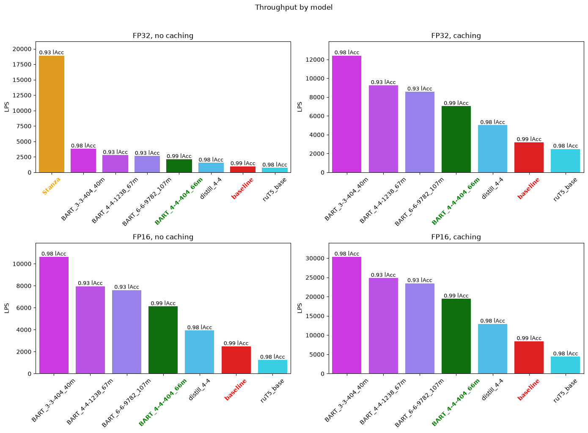

# Lemmatization-Benchmark-Harness

Обвязка для замеров качества/быстродействия генеративных моделей для задач лемматизации

Для перегенерации визуала:

```bash
uv run generate_visuals.py 
```

<!-- AUTO-GENERATED-BENCHMARKS:START -->

## Benchmark results

### Metrics

| Metric | Description |
| --- | --- |
| `LPS` | Amound of lemma predictions generated per second. |
| `lAcc` | Lemmatization Accuracy (Lyashevskaya et al., 2020), which is a standard accuracy metric, disregarding letter capitalization and е or ё choice in prediction and label. |
| `lAcc (norm)` | Lemmatization Accuracy calculated on lemmatized forms of both prediction and label. |
| `CER (total)` | Character Error Rate (MacKenzie & Soukoreff, 2002) calculated between alld predictions and their corresponding labels. |
| `CER (errors)` | Character Error Rate (MacKenzie & Soukoreff, 2002) calculated between wrong predictions and their corresponding labels. |

### Models

| Model | Parameters | Comment |
| --- | ---: | --- |
| `baseline` | 139,420,416 | RNC model (Afanasev et al., 2025) |
| `distill_4-4` | 92,330,752 | response-based distilled baseline |
| `ruT5_base` | 222,903,552 | This model exhibited comparable LPS while employing twice as much parameters because of the tokenizer |
| `BART_4-4-404_66m` | 101,127,168 | best performing BART model with 4 layers of encoder/decoder and an extended char-level BPE tokenizer |
| `BART_3-3-404` | 40,645,632 | BART model with 3 layers of encoder/decoder and an extended char-level BPE tokenizer |
| `BART_4-4-1238_67m` | 67,269,120 | BART model with 4 layers of encoder/decoder and a mowphologically-aware tokenizer (trained on corpus with unsplit affixes and splitted roots) |

### Throughput



### Quality

<h2> test

<h3>all</h3>
<table>
<thead>
<tr><th rowspan="2">model</th>
<th colspan="4">all</th>
<th colspan="4">1-100</th>
<th colspan="4">101-1000</th>
<th colspan="4">1001-10000</th>
<th colspan="4">10001-n</th>
<th colspan="4">punct</th>
</tr><tr>
<th>lAcc</th>
<th>lAcc_n</th>
<th>CER</th>
<th>CER_e</th>
<th>lAcc</th>
<th>lAcc_n</th>
<th>CER</th>
<th>CER_e</th>
<th>lAcc</th>
<th>lAcc_n</th>
<th>CER</th>
<th>CER_e</th>
<th>lAcc</th>
<th>lAcc_n</th>
<th>CER</th>
<th>CER_e</th>
<th>lAcc</th>
<th>lAcc_n</th>
<th>CER</th>
<th>CER_e</th>
<th>lAcc</th>
<th>lAcc_n</th>
<th>CER</th>
<th>CER_e</th>
</tr></thead><tbody>
<tr><td>baseline</td>
<td>0.99</td>
<td>0.99</td>
<td>0.00</td>
<td>0.41</td>
<td>1.00</td>
<td>1.00</td>
<td>0.00</td>
<td>0.59</td>
<td>0.99</td>
<td>1.00</td>
<td><strong>0.00</strong></td>
<td>0.31</td>
<td>0.99</td>
<td>0.99</td>
<td>0.00</td>
<td><strong>0.23</strong></td>
<td>0.95</td>
<td>0.96</td>
<td>0.02</td>
<td>0.48</td>
<td>1.00</td>
<td>1.00</td>
<td>0.00</td>
<td>1.43</td>
</tr>
<tr><td>BART_4-4-404_66m</td>
<td><strong>0.99</strong></td>
<td><strong>1.00</strong></td>
<td><strong>0.00</strong></td>
<td>0.31</td>
<td><strong>1.00</strong></td>
<td><strong>1.00</strong></td>
<td><strong>0.00</strong></td>
<td>0.55</td>
<td><strong>0.99</strong></td>
<td><strong>1.00</strong></td>
<td>0.00</td>
<td>0.40</td>
<td><strong>0.99</strong></td>
<td><strong>1.00</strong></td>
<td><strong>0.00</strong></td>
<td>0.32</td>
<td><strong>0.97</strong></td>
<td><strong>0.98</strong></td>
<td><strong>0.01</strong></td>
<td><strong>0.25</strong></td>
<td><strong>1.00</strong></td>
<td><strong>1.00</strong></td>
<td><strong>0.00</strong></td>
<td>0.70</td>
</tr>
<tr><td>distill_4-4</td>
<td>0.98</td>
<td>0.99</td>
<td>0.01</td>
<td>0.42</td>
<td>1.00</td>
<td>1.00</td>
<td>0.00</td>
<td>0.64</td>
<td>0.99</td>
<td>0.99</td>
<td>0.00</td>
<td><strong>0.29</strong></td>
<td>0.97</td>
<td>0.97</td>
<td>0.01</td>
<td>0.23</td>
<td>0.93</td>
<td>0.93</td>
<td>0.04</td>
<td>0.52</td>
<td>1.00</td>
<td>1.00</td>
<td>0.00</td>
<td>2.49</td>
</tr>
<tr><td>BART_4-4-1238_67m</td>
<td>0.94</td>
<td>0.94</td>
<td>0.04</td>
<td>0.66</td>
<td>1.00</td>
<td>1.00</td>
<td>0.00</td>
<td>0.95</td>
<td>0.96</td>
<td>0.96</td>
<td>0.03</td>
<td>0.59</td>
<td>0.95</td>
<td>0.95</td>
<td>0.03</td>
<td>0.65</td>
<td>0.86</td>
<td>0.87</td>
<td>0.09</td>
<td>0.68</td>
<td>0.86</td>
<td>0.86</td>
<td>0.09</td>
<td><strong>0.65</strong></td>
</tr>
<tr><td>BART_3-3-404_40m</td>
<td>0.98</td>
<td>0.99</td>
<td>0.00</td>
<td><strong>0.28</strong></td>
<td>1.00</td>
<td>1.00</td>
<td>0.00</td>
<td><strong>0.51</strong></td>
<td>0.99</td>
<td>0.99</td>
<td>0.00</td>
<td>0.35</td>
<td>0.97</td>
<td>0.97</td>
<td>0.01</td>
<td>0.24</td>
<td>0.92</td>
<td>0.94</td>
<td>0.02</td>
<td>0.26</td>
<td>1.00</td>
<td>1.00</td>
<td>0.00</td>
<td>0.84</td>
</tr>
<tr><td>ruT5_base</td>
<td>0.98</td>
<td>0.98</td>
<td>0.01</td>
<td>0.84</td>
<td>1.00</td>
<td>1.00</td>
<td>0.00</td>
<td>0.91</td>
<td>0.99</td>
<td>0.99</td>
<td>0.01</td>
<td>0.81</td>
<td>0.98</td>
<td>0.98</td>
<td>0.01</td>
<td>0.58</td>
<td>0.92</td>
<td>0.93</td>
<td>0.07</td>
<td>0.92</td>
<td>1.00</td>
<td>1.00</td>
<td>0.00</td>
<td>2.06</td>
</tr>
</tbody></table>

<h3>holdout</h3>
<table>
<thead>
<tr><th rowspan="2">model</th>
<th colspan="4">all</th>
<th colspan="4">1-100</th>
<th colspan="4">101-1000</th>
<th colspan="4">1001-10000</th>
<th colspan="4">10001-n</th>
<th colspan="4">punct</th>
</tr><tr>
<th>lAcc</th>
<th>lAcc_n</th>
<th>CER</th>
<th>CER_e</th>
<th>lAcc</th>
<th>lAcc_n</th>
<th>CER</th>
<th>CER_e</th>
<th>lAcc</th>
<th>lAcc_n</th>
<th>CER</th>
<th>CER_e</th>
<th>lAcc</th>
<th>lAcc_n</th>
<th>CER</th>
<th>CER_e</th>
<th>lAcc</th>
<th>lAcc_n</th>
<th>CER</th>
<th>CER_e</th>
<th>lAcc</th>
<th>lAcc_n</th>
<th>CER</th>
<th>CER_e</th>
</tr></thead><tbody>
<tr><td>baseline</td>
<td>1.00</td>
<td>1.00</td>
<td>0.00</td>
<td>0.45</td>
<td>1.00</td>
<td>1.00</td>
<td>0.00</td>
<td>0.67</td>
<td>1.00</td>
<td>1.00</td>
<td><strong>0.00</strong></td>
<td>0.31</td>
<td>0.99</td>
<td>0.99</td>
<td>0.00</td>
<td>0.26</td>
<td>0.97</td>
<td>0.98</td>
<td>0.02</td>
<td>0.62</td>
<td>1.00</td>
<td>1.00</td>
<td>0.00</td>
<td>1.58</td>
</tr>
<tr><td>BART_4-4-404_66m</td>
<td><strong>1.00</strong></td>
<td><strong>1.00</strong></td>
<td><strong>0.00</strong></td>
<td>0.44</td>
<td><strong>1.00</strong></td>
<td><strong>1.00</strong></td>
<td><strong>0.00</strong></td>
<td>0.61</td>
<td><strong>1.00</strong></td>
<td><strong>1.00</strong></td>
<td>0.00</td>
<td>0.46</td>
<td><strong>1.00</strong></td>
<td><strong>1.00</strong></td>
<td><strong>0.00</strong></td>
<td>0.44</td>
<td><strong>0.99</strong></td>
<td><strong>0.99</strong></td>
<td><strong>0.00</strong></td>
<td><strong>0.32</strong></td>
<td><strong>1.00</strong></td>
<td><strong>1.00</strong></td>
<td><strong>0.00</strong></td>
<td>1.00</td>
</tr>
<tr><td>distill_4-4</td>
<td>0.99</td>
<td>0.99</td>
<td>0.00</td>
<td>0.45</td>
<td>1.00</td>
<td>1.00</td>
<td>0.00</td>
<td>0.70</td>
<td>1.00</td>
<td>1.00</td>
<td>0.00</td>
<td><strong>0.30</strong></td>
<td>0.98</td>
<td>0.98</td>
<td>0.00</td>
<td><strong>0.24</strong></td>
<td>0.96</td>
<td>0.96</td>
<td>0.03</td>
<td>0.64</td>
<td>1.00</td>
<td>1.00</td>
<td>0.00</td>
<td>2.92</td>
</tr>
<tr><td>BART_4-4-1238_67m</td>
<td>0.95</td>
<td>0.95</td>
<td>0.04</td>
<td>0.66</td>
<td>1.00</td>
<td>1.00</td>
<td>0.00</td>
<td>1.01</td>
<td>0.96</td>
<td>0.96</td>
<td>0.02</td>
<td>0.55</td>
<td>0.97</td>
<td>0.98</td>
<td>0.01</td>
<td>0.58</td>
<td>0.87</td>
<td>0.88</td>
<td>0.10</td>
<td>0.81</td>
<td>0.86</td>
<td>0.86</td>
<td>0.09</td>
<td><strong>0.65</strong></td>
</tr>
<tr><td>BART_3-3-404_40m</td>
<td>0.99</td>
<td>0.99</td>
<td>0.00</td>
<td><strong>0.33</strong></td>
<td>1.00</td>
<td>1.00</td>
<td>0.00</td>
<td><strong>0.57</strong></td>
<td>0.99</td>
<td>0.99</td>
<td>0.00</td>
<td>0.38</td>
<td>0.98</td>
<td>0.98</td>
<td>0.01</td>
<td>0.26</td>
<td>0.96</td>
<td>0.97</td>
<td>0.01</td>
<td>0.34</td>
<td>1.00</td>
<td>1.00</td>
<td>0.00</td>
<td>1.00</td>
</tr>
<tr><td>ruT5_base</td>
<td>0.99</td>
<td>0.99</td>
<td>0.01</td>
<td>0.80</td>
<td>1.00</td>
<td>1.00</td>
<td>0.00</td>
<td>0.87</td>
<td>0.99</td>
<td>0.99</td>
<td>0.01</td>
<td>0.86</td>
<td>0.99</td>
<td>0.99</td>
<td>0.00</td>
<td>0.57</td>
<td>0.96</td>
<td>0.96</td>
<td>0.03</td>
<td>0.74</td>
<td>1.00</td>
<td>1.00</td>
<td>0.00</td>
<td>2.06</td>
</tr>
</tbody></table>

<h3>unknown</h3>
<table>
<thead>
<tr><th rowspan="2">model</th>
<th colspan="4">all</th>
<th colspan="4">1-100</th>
<th colspan="4">101-1000</th>
<th colspan="4">1001-10000</th>
<th colspan="4">10001-n</th>
<th colspan="4">punct</th>
</tr><tr>
<th>lAcc</th>
<th>lAcc_n</th>
<th>CER</th>
<th>CER_e</th>
<th>lAcc</th>
<th>lAcc_n</th>
<th>CER</th>
<th>CER_e</th>
<th>lAcc</th>
<th>lAcc_n</th>
<th>CER</th>
<th>CER_e</th>
<th>lAcc</th>
<th>lAcc_n</th>
<th>CER</th>
<th>CER_e</th>
<th>lAcc</th>
<th>lAcc_n</th>
<th>CER</th>
<th>CER_e</th>
<th>lAcc</th>
<th>lAcc_n</th>
<th>CER</th>
<th>CER_e</th>
</tr></thead><tbody>
<tr><td>baseline</td>
<td>0.94</td>
<td>0.95</td>
<td>0.02</td>
<td>0.38</td>
<td>0.88</td>
<td>0.88</td>
<td><strong>0.04</strong></td>
<td><strong>0.35</strong></td>
<td><strong>0.94</strong></td>
<td><strong>0.95</strong></td>
<td><strong>0.02</strong></td>
<td>0.30</td>
<td>0.97</td>
<td>0.97</td>
<td>0.01</td>
<td><strong>0.17</strong></td>
<td>0.93</td>
<td>0.94</td>
<td>0.03</td>
<td>0.43</td>
<td>0.50</td>
<td>0.50</td>
<td>0.40</td>
<td>0.81</td>
</tr>
<tr><td>BART_4-4-404_66m</td>
<td><strong>0.96</strong></td>
<td><strong>0.97</strong></td>
<td><strong>0.01</strong></td>
<td>0.25</td>
<td>0.86</td>
<td>0.87</td>
<td>0.06</td>
<td>0.42</td>
<td>0.94</td>
<td>0.94</td>
<td>0.02</td>
<td>0.33</td>
<td><strong>0.98</strong></td>
<td><strong>0.98</strong></td>
<td><strong>0.00</strong></td>
<td>0.23</td>
<td><strong>0.95</strong></td>
<td><strong>0.96</strong></td>
<td><strong>0.01</strong></td>
<td><strong>0.23</strong></td>
<td>0.67</td>
<td>0.67</td>
<td>0.08</td>
<td>0.25</td>
</tr>
<tr><td>distill_4-4</td>
<td>0.91</td>
<td>0.91</td>
<td>0.04</td>
<td>0.39</td>
<td>0.83</td>
<td>0.86</td>
<td>0.08</td>
<td>0.50</td>
<td>0.90</td>
<td>0.91</td>
<td>0.03</td>
<td><strong>0.28</strong></td>
<td>0.92</td>
<td>0.92</td>
<td>0.02</td>
<td>0.21</td>
<td>0.90</td>
<td>0.91</td>
<td>0.05</td>
<td>0.47</td>
<td>0.50</td>
<td>0.50</td>
<td>0.40</td>
<td>0.80</td>
</tr>
<tr><td>BART_4-4-1238_67m</td>
<td>0.84</td>
<td>0.84</td>
<td>0.10</td>
<td>0.65</td>
<td>0.73</td>
<td>0.74</td>
<td>0.20</td>
<td>0.75</td>
<td>0.73</td>
<td>0.73</td>
<td>0.20</td>
<td>0.73</td>
<td>0.83</td>
<td>0.84</td>
<td>0.12</td>
<td>0.71</td>
<td>0.85</td>
<td>0.86</td>
<td>0.09</td>
<td>0.59</td>
<td>0.17</td>
<td>0.17</td>
<td>0.30</td>
<td>0.36</td>
</tr>
<tr><td>BART_3-3-404_40m</td>
<td>0.89</td>
<td>0.91</td>
<td>0.03</td>
<td><strong>0.24</strong></td>
<td>0.77</td>
<td>0.79</td>
<td>0.09</td>
<td>0.40</td>
<td>0.88</td>
<td>0.89</td>
<td>0.04</td>
<td>0.31</td>
<td>0.90</td>
<td>0.91</td>
<td>0.02</td>
<td>0.22</td>
<td>0.89</td>
<td>0.91</td>
<td>0.03</td>
<td>0.23</td>
<td>0.33</td>
<td>0.33</td>
<td>0.19</td>
<td>0.28</td>
</tr>
<tr><td>ruT5_base</td>
<td>0.89</td>
<td>0.90</td>
<td>0.09</td>
<td>0.87</td>
<td><strong>0.90</strong></td>
<td><strong>0.91</strong></td>
<td>0.14</td>
<td>1.41</td>
<td>0.87</td>
<td>0.88</td>
<td>0.09</td>
<td>0.71</td>
<td>0.92</td>
<td>0.92</td>
<td>0.05</td>
<td>0.59</td>
<td>0.89</td>
<td>0.90</td>
<td>0.11</td>
<td>0.97</td>
<td><strong>1.00</strong></td>
<td><strong>1.00</strong></td>
<td><strong>0.00</strong></td>
<td><strong>0.00</strong></td>
</tr>
</tbody></table> </h2>
<h2> school

<h3>all</h3>
<table>
<thead>
<tr><th rowspan="2">model</th>
<th colspan="4">all</th>
<th colspan="4">1-100</th>
<th colspan="4">101-1000</th>
<th colspan="4">1001-10000</th>
<th colspan="4">10001-n</th>
<th colspan="4">punct</th>
</tr><tr>
<th>lAcc</th>
<th>lAcc_n</th>
<th>CER</th>
<th>CER_e</th>
<th>lAcc</th>
<th>lAcc_n</th>
<th>CER</th>
<th>CER_e</th>
<th>lAcc</th>
<th>lAcc_n</th>
<th>CER</th>
<th>CER_e</th>
<th>lAcc</th>
<th>lAcc_n</th>
<th>CER</th>
<th>CER_e</th>
<th>lAcc</th>
<th>lAcc_n</th>
<th>CER</th>
<th>CER_e</th>
<th>lAcc</th>
<th>lAcc_n</th>
<th>CER</th>
<th>CER_e</th>
</tr></thead><tbody>
<tr><td>baseline</td>
<td>0.99</td>
<td>0.99</td>
<td>0.00</td>
<td><strong>0.38</strong></td>
<td>1.00</td>
<td>1.00</td>
<td>0.00</td>
<td><strong>0.58</strong></td>
<td>0.99</td>
<td>0.99</td>
<td>0.00</td>
<td><strong>0.26</strong></td>
<td>0.99</td>
<td>0.99</td>
<td>0.00</td>
<td><strong>0.22</strong></td>
<td>0.96</td>
<td>0.96</td>
<td>0.02</td>
<td>0.48</td>
<td>1.00</td>
<td>1.00</td>
<td>0.00</td>
<td>1.19</td>
</tr>
<tr><td>BART_4-4-404_66m</td>
<td><strong>0.99</strong></td>
<td><strong>0.99</strong></td>
<td><strong>0.00</strong></td>
<td>0.41</td>
<td>1.00</td>
<td>1.00</td>
<td>0.00</td>
<td>1.00</td>
<td>0.99</td>
<td>0.99</td>
<td>0.00</td>
<td>0.35</td>
<td><strong>1.00</strong></td>
<td><strong>1.00</strong></td>
<td><strong>0.00</strong></td>
<td>0.41</td>
<td><strong>0.96</strong></td>
<td><strong>0.97</strong></td>
<td><strong>0.01</strong></td>
<td>0.37</td>
<td><strong>1.00</strong></td>
<td><strong>1.00</strong></td>
<td><strong>0.00</strong></td>
<td>1.00</td>
</tr>
<tr><td>distill_4-4</td>
<td>0.99</td>
<td>0.99</td>
<td>0.01</td>
<td>0.42</td>
<td>1.00</td>
<td>1.00</td>
<td><strong>0.00</strong></td>
<td>0.73</td>
<td>0.99</td>
<td>0.99</td>
<td>0.00</td>
<td>0.30</td>
<td>0.98</td>
<td>0.98</td>
<td>0.01</td>
<td>0.22</td>
<td>0.94</td>
<td>0.95</td>
<td>0.03</td>
<td>0.51</td>
<td>1.00</td>
<td>1.00</td>
<td>0.00</td>
<td>2.91</td>
</tr>
<tr><td>BART_4-4-1238_67m</td>
<td>0.93</td>
<td>0.93</td>
<td>0.05</td>
<td>0.70</td>
<td>1.00</td>
<td>1.00</td>
<td>0.00</td>
<td>1.58</td>
<td>0.99</td>
<td>0.99</td>
<td>0.00</td>
<td>0.34</td>
<td>0.99</td>
<td>0.99</td>
<td>0.00</td>
<td>0.35</td>
<td>0.91</td>
<td>0.92</td>
<td>0.06</td>
<td>0.61</td>
<td>0.77</td>
<td>0.77</td>
<td>0.17</td>
<td><strong>0.75</strong></td>
</tr>
<tr><td>BART_3-3-404_40m</td>
<td>0.98</td>
<td>0.99</td>
<td>0.01</td>
<td>0.63</td>
<td>0.99</td>
<td>0.99</td>
<td>0.02</td>
<td>2.82</td>
<td>0.99</td>
<td>0.99</td>
<td>0.00</td>
<td>0.40</td>
<td>0.98</td>
<td>0.98</td>
<td>0.01</td>
<td>0.24</td>
<td>0.93</td>
<td>0.94</td>
<td>0.02</td>
<td><strong>0.28</strong></td>
<td>1.00</td>
<td>1.00</td>
<td>0.00</td>
<td>0.99</td>
</tr>
<tr><td>ruT5_base</td>
<td>0.99</td>
<td>0.99</td>
<td>0.01</td>
<td>0.83</td>
<td><strong>1.00</strong></td>
<td><strong>1.00</strong></td>
<td>0.00</td>
<td>0.93</td>
<td><strong>1.00</strong></td>
<td><strong>1.00</strong></td>
<td><strong>0.00</strong></td>
<td>0.51</td>
<td>0.99</td>
<td>1.00</td>
<td>0.00</td>
<td>0.49</td>
<td>0.96</td>
<td>0.97</td>
<td>0.02</td>
<td>0.40</td>
<td>0.99</td>
<td>0.99</td>
<td>0.02</td>
<td>2.78</td>
</tr>
</tbody></table>

<h3>holdout</h3>
<table>
<thead>
<tr><th rowspan="2">model</th>
<th colspan="4">all</th>
<th colspan="4">1-100</th>
<th colspan="4">101-1000</th>
<th colspan="4">1001-10000</th>
<th colspan="4">10001-n</th>
<th colspan="4">punct</th>
</tr><tr>
<th>lAcc</th>
<th>lAcc_n</th>
<th>CER</th>
<th>CER_e</th>
<th>lAcc</th>
<th>lAcc_n</th>
<th>CER</th>
<th>CER_e</th>
<th>lAcc</th>
<th>lAcc_n</th>
<th>CER</th>
<th>CER_e</th>
<th>lAcc</th>
<th>lAcc_n</th>
<th>CER</th>
<th>CER_e</th>
<th>lAcc</th>
<th>lAcc_n</th>
<th>CER</th>
<th>CER_e</th>
<th>lAcc</th>
<th>lAcc_n</th>
<th>CER</th>
<th>CER_e</th>
</tr></thead><tbody>
<tr><td>baseline</td>
<td>0.99</td>
<td>0.99</td>
<td>0.00</td>
<td><strong>0.27</strong></td>
<td><strong>1.00</strong></td>
<td><strong>1.00</strong></td>
<td><strong>0.00</strong></td>
<td><strong>0.55</strong></td>
<td>0.99</td>
<td>0.99</td>
<td>0.00</td>
<td><strong>0.25</strong></td>
<td>0.99</td>
<td>0.99</td>
<td>0.00</td>
<td><strong>0.21</strong></td>
<td>0.98</td>
<td>0.98</td>
<td>0.01</td>
<td>0.36</td>
<td><strong>0.00</strong></td>
<td><strong>0.00</strong></td>
<td><strong>0.00</strong></td>
<td><strong>0.00</strong></td>
</tr>
<tr><td>BART_4-4-404_66m</td>
<td>0.99</td>
<td>0.99</td>
<td>0.00</td>
<td>0.42</td>
<td>1.00</td>
<td>1.00</td>
<td>0.00</td>
<td>0.61</td>
<td>0.99</td>
<td>0.99</td>
<td>0.00</td>
<td>0.34</td>
<td><strong>1.00</strong></td>
<td><strong>1.00</strong></td>
<td><strong>0.00</strong></td>
<td>0.48</td>
<td>0.96</td>
<td>0.97</td>
<td>0.02</td>
<td>0.42</td>
<td><strong>0.00</strong></td>
<td><strong>0.00</strong></td>
<td><strong>0.00</strong></td>
<td><strong>0.00</strong></td>
</tr>
<tr><td>distill_4-4</td>
<td>0.99</td>
<td>0.99</td>
<td>0.00</td>
<td>0.30</td>
<td>1.00</td>
<td>1.00</td>
<td>0.00</td>
<td>0.63</td>
<td>0.99</td>
<td>0.99</td>
<td>0.00</td>
<td>0.28</td>
<td>0.98</td>
<td>0.98</td>
<td>0.00</td>
<td>0.22</td>
<td>0.96</td>
<td>0.97</td>
<td>0.02</td>
<td>0.43</td>
<td><strong>0.00</strong></td>
<td><strong>0.00</strong></td>
<td><strong>0.00</strong></td>
<td><strong>0.00</strong></td>
</tr>
<tr><td>BART_4-4-1238_67m</td>
<td>0.98</td>
<td>0.98</td>
<td>0.01</td>
<td>0.60</td>
<td><strong>1.00</strong></td>
<td><strong>1.00</strong></td>
<td>0.00</td>
<td>0.55</td>
<td>0.99</td>
<td>0.99</td>
<td>0.00</td>
<td>0.31</td>
<td>0.99</td>
<td>0.99</td>
<td>0.00</td>
<td>0.32</td>
<td>0.89</td>
<td>0.90</td>
<td>0.08</td>
<td>0.77</td>
<td><strong>0.00</strong></td>
<td><strong>0.00</strong></td>
<td><strong>0.00</strong></td>
<td><strong>0.00</strong></td>
</tr>
<tr><td>BART_3-3-404_40m</td>
<td>0.99</td>
<td>0.99</td>
<td>0.00</td>
<td>0.32</td>
<td>1.00</td>
<td>1.00</td>
<td>0.00</td>
<td>0.58</td>
<td>0.99</td>
<td>0.99</td>
<td>0.00</td>
<td>0.41</td>
<td>0.98</td>
<td>0.98</td>
<td>0.00</td>
<td>0.24</td>
<td>0.94</td>
<td>0.95</td>
<td>0.02</td>
<td>0.35</td>
<td><strong>0.00</strong></td>
<td><strong>0.00</strong></td>
<td><strong>0.00</strong></td>
<td><strong>0.00</strong></td>
</tr>
<tr><td>ruT5_base</td>
<td><strong>1.00</strong></td>
<td><strong>1.00</strong></td>
<td><strong>0.00</strong></td>
<td>0.41</td>
<td>1.00</td>
<td>1.00</td>
<td>0.00</td>
<td>0.60</td>
<td><strong>1.00</strong></td>
<td><strong>1.00</strong></td>
<td><strong>0.00</strong></td>
<td>0.50</td>
<td>1.00</td>
<td>1.00</td>
<td>0.00</td>
<td>0.48</td>
<td><strong>0.99</strong></td>
<td><strong>0.99</strong></td>
<td><strong>0.00</strong></td>
<td><strong>0.22</strong></td>
<td><strong>0.00</strong></td>
<td><strong>0.00</strong></td>
<td><strong>0.00</strong></td>
<td><strong>0.00</strong></td>
</tr>
</tbody></table>

<h3>unknown</h3>
<table>
<thead>
<tr><th rowspan="2">model</th>
<th colspan="4">all</th>
<th colspan="4">1-100</th>
<th colspan="4">101-1000</th>
<th colspan="4">1001-10000</th>
<th colspan="4">10001-n</th>
<th colspan="4">punct</th>
</tr><tr>
<th>lAcc</th>
<th>lAcc_n</th>
<th>CER</th>
<th>CER_e</th>
<th>lAcc</th>
<th>lAcc_n</th>
<th>CER</th>
<th>CER_e</th>
<th>lAcc</th>
<th>lAcc_n</th>
<th>CER</th>
<th>CER_e</th>
<th>lAcc</th>
<th>lAcc_n</th>
<th>CER</th>
<th>CER_e</th>
<th>lAcc</th>
<th>lAcc_n</th>
<th>CER</th>
<th>CER_e</th>
<th>lAcc</th>
<th>lAcc_n</th>
<th>CER</th>
<th>CER_e</th>
</tr></thead><tbody>
<tr><td>baseline</td>
<td>0.99</td>
<td>0.99</td>
<td>0.01</td>
<td>0.48</td>
<td>1.00</td>
<td>1.00</td>
<td>0.00</td>
<td><strong>0.61</strong></td>
<td>0.97</td>
<td>0.97</td>
<td>0.01</td>
<td><strong>0.28</strong></td>
<td>0.99</td>
<td>0.99</td>
<td><strong>0.00</strong></td>
<td>0.24</td>
<td>0.94</td>
<td>0.95</td>
<td>0.03</td>
<td>0.51</td>
<td>1.00</td>
<td>1.00</td>
<td>0.00</td>
<td>1.19</td>
</tr>
<tr><td>BART_4-4-404_66m</td>
<td><strong>0.99</strong></td>
<td><strong>1.00</strong></td>
<td><strong>0.00</strong></td>
<td><strong>0.40</strong></td>
<td>1.00</td>
<td>1.00</td>
<td>0.00</td>
<td>1.41</td>
<td><strong>1.00</strong></td>
<td><strong>1.00</strong></td>
<td><strong>0.00</strong></td>
<td>0.50</td>
<td><strong>0.99</strong></td>
<td><strong>0.99</strong></td>
<td>0.00</td>
<td>0.32</td>
<td><strong>0.96</strong></td>
<td><strong>0.97</strong></td>
<td><strong>0.01</strong></td>
<td>0.34</td>
<td><strong>1.00</strong></td>
<td><strong>1.00</strong></td>
<td><strong>0.00</strong></td>
<td>1.00</td>
</tr>
<tr><td>distill_4-4</td>
<td>0.99</td>
<td>0.99</td>
<td>0.01</td>
<td>0.53</td>
<td><strong>1.00</strong></td>
<td><strong>1.00</strong></td>
<td><strong>0.00</strong></td>
<td>0.91</td>
<td>0.99</td>
<td>0.99</td>
<td>0.00</td>
<td>0.44</td>
<td>0.96</td>
<td>0.96</td>
<td>0.01</td>
<td><strong>0.22</strong></td>
<td>0.92</td>
<td>0.94</td>
<td>0.04</td>
<td>0.53</td>
<td>1.00</td>
<td>1.00</td>
<td>0.00</td>
<td>2.91</td>
</tr>
<tr><td>BART_4-4-1238_67m</td>
<td>0.88</td>
<td>0.88</td>
<td>0.09</td>
<td>0.72</td>
<td>1.00</td>
<td>1.00</td>
<td>0.00</td>
<td>2.56</td>
<td>0.97</td>
<td>0.97</td>
<td>0.01</td>
<td>0.48</td>
<td>0.97</td>
<td>0.97</td>
<td>0.01</td>
<td>0.39</td>
<td>0.92</td>
<td>0.93</td>
<td>0.04</td>
<td>0.47</td>
<td>0.77</td>
<td>0.77</td>
<td>0.17</td>
<td><strong>0.75</strong></td>
</tr>
<tr><td>BART_3-3-404_40m</td>
<td>0.98</td>
<td>0.98</td>
<td>0.02</td>
<td>0.86</td>
<td>0.99</td>
<td>0.99</td>
<td>0.04</td>
<td>3.07</td>
<td>0.98</td>
<td>0.98</td>
<td>0.01</td>
<td>0.35</td>
<td>0.94</td>
<td>0.95</td>
<td>0.01</td>
<td>0.24</td>
<td>0.92</td>
<td>0.94</td>
<td>0.02</td>
<td><strong>0.25</strong></td>
<td>1.00</td>
<td>1.00</td>
<td>0.00</td>
<td>0.99</td>
</tr>
<tr><td>ruT5_base</td>
<td>0.99</td>
<td>0.99</td>
<td>0.01</td>
<td>0.95</td>
<td>1.00</td>
<td>1.00</td>
<td>0.00</td>
<td>1.41</td>
<td>0.99</td>
<td>0.99</td>
<td>0.00</td>
<td>0.59</td>
<td>0.98</td>
<td>0.99</td>
<td>0.01</td>
<td>0.50</td>
<td>0.94</td>
<td>0.95</td>
<td>0.03</td>
<td>0.43</td>
<td>0.99</td>
<td>0.99</td>
<td>0.02</td>
<td>2.78</td>
</tr>
</tbody></table> </h2>
<h2> poetic_18

<h3>all</h3>
<table>
<thead>
<tr><th rowspan="2">model</th>
<th colspan="4">all</th>
<th colspan="4">1-100</th>
<th colspan="4">101-1000</th>
<th colspan="4">1001-10000</th>
<th colspan="4">10001-n</th>
<th colspan="4">punct</th>
</tr><tr>
<th>lAcc</th>
<th>lAcc_n</th>
<th>CER</th>
<th>CER_e</th>
<th>lAcc</th>
<th>lAcc_n</th>
<th>CER</th>
<th>CER_e</th>
<th>lAcc</th>
<th>lAcc_n</th>
<th>CER</th>
<th>CER_e</th>
<th>lAcc</th>
<th>lAcc_n</th>
<th>CER</th>
<th>CER_e</th>
<th>lAcc</th>
<th>lAcc_n</th>
<th>CER</th>
<th>CER_e</th>
<th>lAcc</th>
<th>lAcc_n</th>
<th>CER</th>
<th>CER_e</th>
</tr></thead><tbody>
<tr><td>baseline</td>
<td>0.99</td>
<td>0.99</td>
<td>0.01</td>
<td>0.35</td>
<td><strong>1.00</strong></td>
<td><strong>1.00</strong></td>
<td><strong>0.00</strong></td>
<td>0.60</td>
<td><strong>0.99</strong></td>
<td><strong>0.99</strong></td>
<td><strong>0.00</strong></td>
<td>0.39</td>
<td>0.98</td>
<td>0.99</td>
<td>0.00</td>
<td>0.29</td>
<td>0.94</td>
<td>0.95</td>
<td>0.02</td>
<td>0.34</td>
<td>1.00</td>
<td>1.00</td>
<td>0.00</td>
<td>1.00</td>
</tr>
<tr><td>BART_4-4-404_66m</td>
<td><strong>0.99</strong></td>
<td><strong>0.99</strong></td>
<td><strong>0.00</strong></td>
<td>0.36</td>
<td>1.00</td>
<td>1.00</td>
<td>0.00</td>
<td>0.62</td>
<td>0.99</td>
<td>0.99</td>
<td>0.01</td>
<td>0.42</td>
<td><strong>0.99</strong></td>
<td><strong>0.99</strong></td>
<td><strong>0.00</strong></td>
<td>0.30</td>
<td><strong>0.94</strong></td>
<td><strong>0.95</strong></td>
<td><strong>0.02</strong></td>
<td>0.33</td>
<td><strong>1.00</strong></td>
<td><strong>1.00</strong></td>
<td><strong>0.00</strong></td>
<td>0.97</td>
</tr>
<tr><td>distill_4-4</td>
<td>0.97</td>
<td>0.97</td>
<td>0.01</td>
<td>0.34</td>
<td>1.00</td>
<td>1.00</td>
<td>0.00</td>
<td>0.66</td>
<td>0.98</td>
<td>0.99</td>
<td>0.01</td>
<td><strong>0.37</strong></td>
<td>0.95</td>
<td>0.96</td>
<td>0.01</td>
<td><strong>0.25</strong></td>
<td>0.90</td>
<td>0.91</td>
<td>0.03</td>
<td>0.32</td>
<td>1.00</td>
<td>1.00</td>
<td>0.00</td>
<td>1.87</td>
</tr>
<tr><td>BART_4-4-1238_67m</td>
<td>0.97</td>
<td>0.97</td>
<td>0.02</td>
<td>0.54</td>
<td>1.00</td>
<td>1.00</td>
<td>0.00</td>
<td>0.62</td>
<td>0.99</td>
<td>0.99</td>
<td>0.01</td>
<td>0.41</td>
<td>0.98</td>
<td>0.99</td>
<td>0.00</td>
<td>0.30</td>
<td>0.93</td>
<td>0.94</td>
<td>0.03</td>
<td>0.42</td>
<td>0.94</td>
<td>0.94</td>
<td>0.04</td>
<td><strong>0.74</strong></td>
</tr>
<tr><td>BART_3-3-404_40m</td>
<td>0.96</td>
<td>0.97</td>
<td>0.01</td>
<td><strong>0.31</strong></td>
<td>1.00</td>
<td>1.00</td>
<td>0.00</td>
<td><strong>0.60</strong></td>
<td>0.98</td>
<td>0.98</td>
<td>0.01</td>
<td>0.40</td>
<td>0.94</td>
<td>0.94</td>
<td>0.02</td>
<td>0.28</td>
<td>0.87</td>
<td>0.88</td>
<td>0.04</td>
<td><strong>0.30</strong></td>
<td>1.00</td>
<td>1.00</td>
<td>0.00</td>
<td>0.97</td>
</tr>
<tr><td>ruT5_base</td>
<td>0.98</td>
<td>0.98</td>
<td>0.01</td>
<td>0.49</td>
<td>1.00</td>
<td>1.00</td>
<td>0.00</td>
<td>0.79</td>
<td>0.99</td>
<td>0.99</td>
<td>0.01</td>
<td>0.52</td>
<td>0.98</td>
<td>0.99</td>
<td>0.01</td>
<td>0.47</td>
<td>0.89</td>
<td>0.90</td>
<td>0.05</td>
<td>0.40</td>
<td>1.00</td>
<td>1.00</td>
<td>0.01</td>
<td>2.99</td>
</tr>
</tbody></table>

<h3>holdout</h3>
<table>
<thead>
<tr><th rowspan="2">model</th>
<th colspan="4">all</th>
<th colspan="4">1-100</th>
<th colspan="4">101-1000</th>
<th colspan="4">1001-10000</th>
<th colspan="4">10001-n</th>
<th colspan="4">punct</th>
</tr><tr>
<th>lAcc</th>
<th>lAcc_n</th>
<th>CER</th>
<th>CER_e</th>
<th>lAcc</th>
<th>lAcc_n</th>
<th>CER</th>
<th>CER_e</th>
<th>lAcc</th>
<th>lAcc_n</th>
<th>CER</th>
<th>CER_e</th>
<th>lAcc</th>
<th>lAcc_n</th>
<th>CER</th>
<th>CER_e</th>
<th>lAcc</th>
<th>lAcc_n</th>
<th>CER</th>
<th>CER_e</th>
<th>lAcc</th>
<th>lAcc_n</th>
<th>CER</th>
<th>CER_e</th>
</tr></thead><tbody>
<tr><td>baseline</td>
<td>0.99</td>
<td>1.00</td>
<td>0.00</td>
<td>0.38</td>
<td>1.00</td>
<td><strong>1.00</strong></td>
<td><strong>0.00</strong></td>
<td><strong>0.51</strong></td>
<td>0.99</td>
<td>0.99</td>
<td><strong>0.00</strong></td>
<td><strong>0.40</strong></td>
<td>0.99</td>
<td>0.99</td>
<td>0.00</td>
<td>0.30</td>
<td>0.97</td>
<td>0.98</td>
<td>0.01</td>
<td>0.32</td>
<td>1.00</td>
<td>1.00</td>
<td>0.00</td>
<td>1.00</td>
</tr>
<tr><td>BART_4-4-404_66m</td>
<td><strong>1.00</strong></td>
<td><strong>1.00</strong></td>
<td><strong>0.00</strong></td>
<td>0.43</td>
<td>1.00</td>
<td>1.00</td>
<td>0.00</td>
<td>0.53</td>
<td>0.99</td>
<td>0.99</td>
<td>0.00</td>
<td>0.45</td>
<td><strong>1.00</strong></td>
<td><strong>1.00</strong></td>
<td><strong>0.00</strong></td>
<td>0.34</td>
<td><strong>0.98</strong></td>
<td><strong>0.98</strong></td>
<td><strong>0.01</strong></td>
<td>0.33</td>
<td><strong>1.00</strong></td>
<td><strong>1.00</strong></td>
<td><strong>0.00</strong></td>
<td>0.97</td>
</tr>
<tr><td>distill_4-4</td>
<td>0.99</td>
<td>0.99</td>
<td>0.00</td>
<td>0.38</td>
<td>1.00</td>
<td>1.00</td>
<td>0.00</td>
<td>0.59</td>
<td>0.99</td>
<td>0.99</td>
<td>0.00</td>
<td>0.41</td>
<td>0.97</td>
<td>0.98</td>
<td>0.01</td>
<td><strong>0.25</strong></td>
<td>0.95</td>
<td>0.96</td>
<td>0.02</td>
<td>0.33</td>
<td>1.00</td>
<td>1.00</td>
<td>0.00</td>
<td>1.87</td>
</tr>
<tr><td>BART_4-4-1238_67m</td>
<td>0.98</td>
<td>0.98</td>
<td>0.01</td>
<td>0.67</td>
<td><strong>1.00</strong></td>
<td><strong>1.00</strong></td>
<td>0.00</td>
<td>0.57</td>
<td>0.99</td>
<td>0.99</td>
<td>0.00</td>
<td>0.41</td>
<td>0.99</td>
<td>1.00</td>
<td>0.00</td>
<td>0.32</td>
<td>0.96</td>
<td>0.96</td>
<td>0.03</td>
<td>0.66</td>
<td>0.94</td>
<td>0.94</td>
<td>0.04</td>
<td><strong>0.74</strong></td>
</tr>
<tr><td>BART_3-3-404_40m</td>
<td>0.99</td>
<td>0.99</td>
<td>0.01</td>
<td><strong>0.34</strong></td>
<td>1.00</td>
<td>1.00</td>
<td>0.00</td>
<td>0.62</td>
<td>0.99</td>
<td>0.99</td>
<td>0.01</td>
<td>0.41</td>
<td>0.97</td>
<td>0.97</td>
<td>0.01</td>
<td>0.28</td>
<td>0.92</td>
<td>0.93</td>
<td>0.02</td>
<td><strong>0.31</strong></td>
<td>1.00</td>
<td>1.00</td>
<td>0.00</td>
<td>0.97</td>
</tr>
<tr><td>ruT5_base</td>
<td>0.99</td>
<td>1.00</td>
<td>0.00</td>
<td>0.76</td>
<td>1.00</td>
<td>1.00</td>
<td>0.00</td>
<td>0.59</td>
<td><strong>0.99</strong></td>
<td><strong>0.99</strong></td>
<td>0.00</td>
<td>0.52</td>
<td>0.99</td>
<td>1.00</td>
<td>0.00</td>
<td>0.49</td>
<td>0.97</td>
<td>0.98</td>
<td>0.01</td>
<td>0.47</td>
<td>1.00</td>
<td>1.00</td>
<td>0.01</td>
<td>2.99</td>
</tr>
</tbody></table>

<h3>unknown</h3>
<table>
<thead>
<tr><th rowspan="2">model</th>
<th colspan="4">all</th>
<th colspan="4">1-100</th>
<th colspan="4">101-1000</th>
<th colspan="4">1001-10000</th>
<th colspan="4">10001-n</th>
<th colspan="4">punct</th>
</tr><tr>
<th>lAcc</th>
<th>lAcc_n</th>
<th>CER</th>
<th>CER_e</th>
<th>lAcc</th>
<th>lAcc_n</th>
<th>CER</th>
<th>CER_e</th>
<th>lAcc</th>
<th>lAcc_n</th>
<th>CER</th>
<th>CER_e</th>
<th>lAcc</th>
<th>lAcc_n</th>
<th>CER</th>
<th>CER_e</th>
<th>lAcc</th>
<th>lAcc_n</th>
<th>CER</th>
<th>CER_e</th>
<th>lAcc</th>
<th>lAcc_n</th>
<th>CER</th>
<th>CER_e</th>
</tr></thead><tbody>
<tr><td>baseline</td>
<td><strong>0.93</strong></td>
<td><strong>0.94</strong></td>
<td>0.02</td>
<td>0.34</td>
<td><strong>0.94</strong></td>
<td>0.94</td>
<td><strong>0.05</strong></td>
<td>0.75</td>
<td><strong>0.95</strong></td>
<td><strong>0.95</strong></td>
<td><strong>0.02</strong></td>
<td>0.37</td>
<td><strong>0.96</strong></td>
<td><strong>0.97</strong></td>
<td><strong>0.01</strong></td>
<td>0.28</td>
<td>0.92</td>
<td>0.93</td>
<td>0.03</td>
<td>0.35</td>
<td><strong>0.00</strong></td>
<td><strong>0.00</strong></td>
<td><strong>0.00</strong></td>
<td><strong>0.00</strong></td>
</tr>
<tr><td>BART_4-4-404_66m</td>
<td>0.93</td>
<td>0.94</td>
<td><strong>0.02</strong></td>
<td>0.33</td>
<td>0.93</td>
<td><strong>0.94</strong></td>
<td>0.05</td>
<td>0.74</td>
<td>0.93</td>
<td>0.94</td>
<td>0.02</td>
<td>0.36</td>
<td>0.96</td>
<td>0.96</td>
<td>0.01</td>
<td>0.29</td>
<td><strong>0.92</strong></td>
<td><strong>0.93</strong></td>
<td><strong>0.03</strong></td>
<td>0.33</td>
<td><strong>0.00</strong></td>
<td><strong>0.00</strong></td>
<td><strong>0.00</strong></td>
<td><strong>0.00</strong></td>
</tr>
<tr><td>distill_4-4</td>
<td>0.87</td>
<td>0.88</td>
<td>0.04</td>
<td>0.31</td>
<td>0.90</td>
<td>0.91</td>
<td>0.08</td>
<td>0.75</td>
<td>0.88</td>
<td>0.89</td>
<td>0.04</td>
<td><strong>0.33</strong></td>
<td>0.88</td>
<td>0.89</td>
<td>0.03</td>
<td><strong>0.26</strong></td>
<td>0.86</td>
<td>0.88</td>
<td>0.04</td>
<td>0.32</td>
<td><strong>0.00</strong></td>
<td><strong>0.00</strong></td>
<td><strong>0.00</strong></td>
<td><strong>0.00</strong></td>
</tr>
<tr><td>BART_4-4-1238_67m</td>
<td>0.92</td>
<td>0.93</td>
<td>0.03</td>
<td>0.35</td>
<td>0.91</td>
<td>0.91</td>
<td>0.06</td>
<td>0.69</td>
<td>0.93</td>
<td>0.94</td>
<td>0.03</td>
<td>0.39</td>
<td>0.95</td>
<td>0.95</td>
<td>0.02</td>
<td>0.29</td>
<td>0.91</td>
<td>0.92</td>
<td>0.03</td>
<td>0.36</td>
<td><strong>0.00</strong></td>
<td><strong>0.00</strong></td>
<td><strong>0.00</strong></td>
<td><strong>0.00</strong></td>
</tr>
<tr><td>BART_3-3-404_40m</td>
<td>0.83</td>
<td>0.85</td>
<td>0.05</td>
<td><strong>0.30</strong></td>
<td>0.82</td>
<td>0.84</td>
<td>0.10</td>
<td><strong>0.58</strong></td>
<td>0.83</td>
<td>0.85</td>
<td>0.06</td>
<td>0.37</td>
<td>0.83</td>
<td>0.85</td>
<td>0.05</td>
<td>0.28</td>
<td>0.83</td>
<td>0.85</td>
<td>0.05</td>
<td><strong>0.29</strong></td>
<td><strong>0.00</strong></td>
<td><strong>0.00</strong></td>
<td><strong>0.00</strong></td>
<td><strong>0.00</strong></td>
</tr>
<tr><td>ruT5_base</td>
<td>0.87</td>
<td>0.89</td>
<td>0.05</td>
<td>0.42</td>
<td>0.92</td>
<td>0.94</td>
<td>0.08</td>
<td>1.07</td>
<td>0.92</td>
<td>0.92</td>
<td>0.04</td>
<td>0.52</td>
<td>0.94</td>
<td>0.95</td>
<td>0.03</td>
<td>0.47</td>
<td>0.84</td>
<td>0.86</td>
<td>0.06</td>
<td>0.40</td>
<td><strong>0.00</strong></td>
<td><strong>0.00</strong></td>
<td><strong>0.00</strong></td>
<td><strong>0.00</strong></td>
</tr>
</tbody></table> </h2>
<h2> poetic_19

<h3>all</h3>
<table>
<thead>
<tr><th rowspan="2">model</th>
<th colspan="4">all</th>
<th colspan="4">1-100</th>
<th colspan="4">101-1000</th>
<th colspan="4">1001-10000</th>
<th colspan="4">10001-n</th>
<th colspan="4">punct</th>
</tr><tr>
<th>lAcc</th>
<th>lAcc_n</th>
<th>CER</th>
<th>CER_e</th>
<th>lAcc</th>
<th>lAcc_n</th>
<th>CER</th>
<th>CER_e</th>
<th>lAcc</th>
<th>lAcc_n</th>
<th>CER</th>
<th>CER_e</th>
<th>lAcc</th>
<th>lAcc_n</th>
<th>CER</th>
<th>CER_e</th>
<th>lAcc</th>
<th>lAcc_n</th>
<th>CER</th>
<th>CER_e</th>
<th>lAcc</th>
<th>lAcc_n</th>
<th>CER</th>
<th>CER_e</th>
</tr></thead><tbody>
<tr><td>baseline</td>
<td>0.99</td>
<td>0.99</td>
<td>0.00</td>
<td>0.40</td>
<td><strong>1.00</strong></td>
<td><strong>1.00</strong></td>
<td><strong>0.00</strong></td>
<td>0.60</td>
<td>0.99</td>
<td>0.99</td>
<td><strong>0.00</strong></td>
<td><strong>0.30</strong></td>
<td>0.99</td>
<td>0.99</td>
<td>0.00</td>
<td>0.27</td>
<td>0.95</td>
<td>0.96</td>
<td>0.02</td>
<td>0.43</td>
<td>1.00</td>
<td>1.00</td>
<td>0.00</td>
<td>1.01</td>
</tr>
<tr><td>BART_4-4-404_66m</td>
<td><strong>0.99</strong></td>
<td><strong>0.99</strong></td>
<td><strong>0.00</strong></td>
<td>0.32</td>
<td>1.00</td>
<td><strong>1.00</strong></td>
<td>0.00</td>
<td>0.61</td>
<td>0.99</td>
<td>0.99</td>
<td>0.00</td>
<td>0.36</td>
<td><strong>0.99</strong></td>
<td><strong>0.99</strong></td>
<td><strong>0.00</strong></td>
<td>0.29</td>
<td><strong>0.96</strong></td>
<td><strong>0.97</strong></td>
<td><strong>0.01</strong></td>
<td>0.28</td>
<td><strong>1.00</strong></td>
<td><strong>1.00</strong></td>
<td><strong>0.00</strong></td>
<td>0.89</td>
</tr>
<tr><td>distill_4-4</td>
<td>0.98</td>
<td>0.98</td>
<td>0.01</td>
<td>0.41</td>
<td>1.00</td>
<td>1.00</td>
<td>0.00</td>
<td>0.64</td>
<td>0.99</td>
<td>0.99</td>
<td>0.00</td>
<td>0.34</td>
<td>0.96</td>
<td>0.97</td>
<td>0.01</td>
<td><strong>0.24</strong></td>
<td>0.91</td>
<td>0.92</td>
<td>0.04</td>
<td>0.41</td>
<td>1.00</td>
<td>1.00</td>
<td>0.01</td>
<td>2.05</td>
</tr>
<tr><td>BART_4-4-1238_67m</td>
<td>0.96</td>
<td>0.96</td>
<td>0.02</td>
<td>0.61</td>
<td>1.00</td>
<td>1.00</td>
<td>0.00</td>
<td>0.60</td>
<td>0.99</td>
<td>0.99</td>
<td>0.00</td>
<td>0.34</td>
<td>0.99</td>
<td>0.99</td>
<td>0.00</td>
<td>0.29</td>
<td>0.93</td>
<td>0.94</td>
<td>0.03</td>
<td>0.49</td>
<td>0.88</td>
<td>0.88</td>
<td>0.08</td>
<td><strong>0.71</strong></td>
</tr>
<tr><td>BART_3-3-404_40m</td>
<td>0.97</td>
<td>0.98</td>
<td>0.01</td>
<td><strong>0.29</strong></td>
<td>1.00</td>
<td>1.00</td>
<td>0.00</td>
<td><strong>0.59</strong></td>
<td>0.98</td>
<td>0.99</td>
<td>0.01</td>
<td>0.36</td>
<td>0.95</td>
<td>0.95</td>
<td>0.01</td>
<td>0.26</td>
<td>0.90</td>
<td>0.91</td>
<td>0.03</td>
<td><strong>0.26</strong></td>
<td>1.00</td>
<td>1.00</td>
<td>0.00</td>
<td>0.90</td>
</tr>
<tr><td>ruT5_base</td>
<td>0.99</td>
<td>0.99</td>
<td>0.01</td>
<td>0.52</td>
<td>1.00</td>
<td>1.00</td>
<td>0.00</td>
<td>0.69</td>
<td><strong>0.99</strong></td>
<td><strong>0.99</strong></td>
<td>0.00</td>
<td>0.40</td>
<td>0.99</td>
<td>0.99</td>
<td>0.01</td>
<td>0.49</td>
<td>0.93</td>
<td>0.94</td>
<td>0.03</td>
<td>0.35</td>
<td>0.99</td>
<td>0.99</td>
<td>0.01</td>
<td>2.08</td>
</tr>
</tbody></table>

<h3>holdout</h3>
<table>
<thead>
<tr><th rowspan="2">model</th>
<th colspan="4">all</th>
<th colspan="4">1-100</th>
<th colspan="4">101-1000</th>
<th colspan="4">1001-10000</th>
<th colspan="4">10001-n</th>
<th colspan="4">punct</th>
</tr><tr>
<th>lAcc</th>
<th>lAcc_n</th>
<th>CER</th>
<th>CER_e</th>
<th>lAcc</th>
<th>lAcc_n</th>
<th>CER</th>
<th>CER_e</th>
<th>lAcc</th>
<th>lAcc_n</th>
<th>CER</th>
<th>CER_e</th>
<th>lAcc</th>
<th>lAcc_n</th>
<th>CER</th>
<th>CER_e</th>
<th>lAcc</th>
<th>lAcc_n</th>
<th>CER</th>
<th>CER_e</th>
<th>lAcc</th>
<th>lAcc_n</th>
<th>CER</th>
<th>CER_e</th>
</tr></thead><tbody>
<tr><td>baseline</td>
<td>0.99</td>
<td>1.00</td>
<td>0.00</td>
<td>0.43</td>
<td><strong>1.00</strong></td>
<td>1.00</td>
<td>0.00</td>
<td>0.61</td>
<td>0.99</td>
<td>0.99</td>
<td><strong>0.00</strong></td>
<td><strong>0.30</strong></td>
<td>0.99</td>
<td>0.99</td>
<td>0.00</td>
<td>0.29</td>
<td>0.97</td>
<td>0.98</td>
<td>0.01</td>
<td>0.48</td>
<td>1.00</td>
<td>1.00</td>
<td>0.00</td>
<td>1.01</td>
</tr>
<tr><td>BART_4-4-404_66m</td>
<td><strong>1.00</strong></td>
<td><strong>1.00</strong></td>
<td><strong>0.00</strong></td>
<td>0.41</td>
<td>1.00</td>
<td><strong>1.00</strong></td>
<td><strong>0.00</strong></td>
<td><strong>0.58</strong></td>
<td>0.99</td>
<td>0.99</td>
<td>0.00</td>
<td>0.36</td>
<td><strong>1.00</strong></td>
<td><strong>1.00</strong></td>
<td><strong>0.00</strong></td>
<td>0.34</td>
<td><strong>0.98</strong></td>
<td><strong>0.99</strong></td>
<td><strong>0.01</strong></td>
<td>0.35</td>
<td><strong>1.00</strong></td>
<td><strong>1.00</strong></td>
<td><strong>0.00</strong></td>
<td>0.89</td>
</tr>
<tr><td>distill_4-4</td>
<td>0.99</td>
<td>0.99</td>
<td>0.01</td>
<td>0.49</td>
<td>1.00</td>
<td>1.00</td>
<td>0.00</td>
<td>0.63</td>
<td>0.99</td>
<td>0.99</td>
<td>0.00</td>
<td>0.35</td>
<td>0.97</td>
<td>0.98</td>
<td>0.01</td>
<td><strong>0.23</strong></td>
<td>0.94</td>
<td>0.95</td>
<td>0.03</td>
<td>0.45</td>
<td>1.00</td>
<td>1.00</td>
<td>0.01</td>
<td>2.05</td>
</tr>
<tr><td>BART_4-4-1238_67m</td>
<td>0.96</td>
<td>0.96</td>
<td>0.02</td>
<td>0.67</td>
<td>1.00</td>
<td><strong>1.00</strong></td>
<td>0.00</td>
<td>0.60</td>
<td>0.99</td>
<td>0.99</td>
<td>0.00</td>
<td>0.33</td>
<td>0.99</td>
<td>0.99</td>
<td>0.00</td>
<td>0.29</td>
<td>0.94</td>
<td>0.95</td>
<td>0.04</td>
<td>0.70</td>
<td>0.88</td>
<td>0.88</td>
<td>0.08</td>
<td><strong>0.71</strong></td>
</tr>
<tr><td>BART_3-3-404_40m</td>
<td>0.99</td>
<td>0.99</td>
<td>0.00</td>
<td><strong>0.33</strong></td>
<td>1.00</td>
<td>1.00</td>
<td>0.00</td>
<td>0.62</td>
<td>0.99</td>
<td>0.99</td>
<td>0.00</td>
<td>0.35</td>
<td>0.97</td>
<td>0.97</td>
<td>0.01</td>
<td>0.26</td>
<td>0.93</td>
<td>0.94</td>
<td>0.02</td>
<td><strong>0.29</strong></td>
<td>1.00</td>
<td>1.00</td>
<td>0.00</td>
<td>0.90</td>
</tr>
<tr><td>ruT5_base</td>
<td>1.00</td>
<td>1.00</td>
<td>0.00</td>
<td>0.89</td>
<td>1.00</td>
<td>1.00</td>
<td>0.00</td>
<td>0.64</td>
<td><strong>0.99</strong></td>
<td><strong>1.00</strong></td>
<td>0.00</td>
<td>0.37</td>
<td>1.00</td>
<td>1.00</td>
<td>0.00</td>
<td>0.57</td>
<td>0.98</td>
<td>0.98</td>
<td>0.01</td>
<td>0.36</td>
<td>0.99</td>
<td>0.99</td>
<td>0.01</td>
<td>2.08</td>
</tr>
</tbody></table>

<h3>unknown</h3>
<table>
<thead>
<tr><th rowspan="2">model</th>
<th colspan="4">all</th>
<th colspan="4">1-100</th>
<th colspan="4">101-1000</th>
<th colspan="4">1001-10000</th>
<th colspan="4">10001-n</th>
<th colspan="4">punct</th>
</tr><tr>
<th>lAcc</th>
<th>lAcc_n</th>
<th>CER</th>
<th>CER_e</th>
<th>lAcc</th>
<th>lAcc_n</th>
<th>CER</th>
<th>CER_e</th>
<th>lAcc</th>
<th>lAcc_n</th>
<th>CER</th>
<th>CER_e</th>
<th>lAcc</th>
<th>lAcc_n</th>
<th>CER</th>
<th>CER_e</th>
<th>lAcc</th>
<th>lAcc_n</th>
<th>CER</th>
<th>CER_e</th>
<th>lAcc</th>
<th>lAcc_n</th>
<th>CER</th>
<th>CER_e</th>
</tr></thead><tbody>
<tr><td>baseline</td>
<td>0.95</td>
<td>0.96</td>
<td>0.02</td>
<td>0.39</td>
<td><strong>0.94</strong></td>
<td><strong>0.94</strong></td>
<td><strong>0.03</strong></td>
<td>0.59</td>
<td>0.96</td>
<td>0.96</td>
<td><strong>0.01</strong></td>
<td><strong>0.32</strong></td>
<td><strong>0.97</strong></td>
<td><strong>0.98</strong></td>
<td><strong>0.01</strong></td>
<td>0.26</td>
<td>0.94</td>
<td>0.95</td>
<td>0.03</td>
<td>0.41</td>
<td><strong>0.00</strong></td>
<td><strong>0.00</strong></td>
<td><strong>0.00</strong></td>
<td><strong>0.00</strong></td>
</tr>
<tr><td>BART_4-4-404_66m</td>
<td><strong>0.96</strong></td>
<td><strong>0.96</strong></td>
<td><strong>0.01</strong></td>
<td>0.28</td>
<td>0.92</td>
<td>0.94</td>
<td>0.06</td>
<td>0.68</td>
<td>0.96</td>
<td><strong>0.97</strong></td>
<td>0.01</td>
<td>0.37</td>
<td>0.97</td>
<td>0.97</td>
<td>0.01</td>
<td>0.27</td>
<td><strong>0.95</strong></td>
<td><strong>0.96</strong></td>
<td><strong>0.01</strong></td>
<td>0.27</td>
<td><strong>0.00</strong></td>
<td><strong>0.00</strong></td>
<td><strong>0.00</strong></td>
<td><strong>0.00</strong></td>
</tr>
<tr><td>distill_4-4</td>
<td>0.89</td>
<td>0.90</td>
<td>0.04</td>
<td>0.35</td>
<td>0.89</td>
<td>0.92</td>
<td>0.07</td>
<td>0.67</td>
<td>0.92</td>
<td>0.93</td>
<td>0.03</td>
<td>0.33</td>
<td>0.90</td>
<td>0.91</td>
<td>0.02</td>
<td><strong>0.25</strong></td>
<td>0.89</td>
<td>0.90</td>
<td>0.04</td>
<td>0.39</td>
<td><strong>0.00</strong></td>
<td><strong>0.00</strong></td>
<td><strong>0.00</strong></td>
<td><strong>0.00</strong></td>
</tr>
<tr><td>BART_4-4-1238_67m</td>
<td>0.94</td>
<td>0.94</td>
<td>0.02</td>
<td>0.36</td>
<td>0.93</td>
<td>0.93</td>
<td>0.04</td>
<td>0.60</td>
<td><strong>0.96</strong></td>
<td>0.97</td>
<td>0.02</td>
<td>0.38</td>
<td>0.96</td>
<td>0.96</td>
<td>0.01</td>
<td>0.29</td>
<td>0.92</td>
<td>0.93</td>
<td>0.03</td>
<td>0.38</td>
<td><strong>0.00</strong></td>
<td><strong>0.00</strong></td>
<td><strong>0.00</strong></td>
<td><strong>0.00</strong></td>
</tr>
<tr><td>BART_3-3-404_40m</td>
<td>0.87</td>
<td>0.89</td>
<td>0.03</td>
<td><strong>0.27</strong></td>
<td>0.80</td>
<td>0.87</td>
<td>0.11</td>
<td><strong>0.55</strong></td>
<td>0.90</td>
<td>0.91</td>
<td>0.04</td>
<td>0.36</td>
<td>0.86</td>
<td>0.87</td>
<td>0.04</td>
<td>0.27</td>
<td>0.88</td>
<td>0.89</td>
<td>0.03</td>
<td><strong>0.25</strong></td>
<td><strong>0.00</strong></td>
<td><strong>0.00</strong></td>
<td><strong>0.00</strong></td>
<td><strong>0.00</strong></td>
</tr>
<tr><td>ruT5_base</td>
<td>0.92</td>
<td>0.93</td>
<td>0.03</td>
<td>0.37</td>
<td>0.91</td>
<td>0.94</td>
<td>0.08</td>
<td>0.84</td>
<td>0.96</td>
<td>0.96</td>
<td>0.02</td>
<td>0.50</td>
<td>0.96</td>
<td>0.96</td>
<td>0.02</td>
<td>0.45</td>
<td>0.89</td>
<td>0.91</td>
<td>0.04</td>
<td>0.35</td>
<td><strong>0.00</strong></td>
<td><strong>0.00</strong></td>
<td><strong>0.00</strong></td>
<td><strong>0.00</strong></td>
</tr>
</tbody></table> </h2>
<h2> poetic_20

<h3>all</h3>
<table>
<thead>
<tr><th rowspan="2">model</th>
<th colspan="4">all</th>
<th colspan="4">1-100</th>
<th colspan="4">101-1000</th>
<th colspan="4">1001-10000</th>
<th colspan="4">10001-n</th>
<th colspan="4">punct</th>
</tr><tr>
<th>lAcc</th>
<th>lAcc_n</th>
<th>CER</th>
<th>CER_e</th>
<th>lAcc</th>
<th>lAcc_n</th>
<th>CER</th>
<th>CER_e</th>
<th>lAcc</th>
<th>lAcc_n</th>
<th>CER</th>
<th>CER_e</th>
<th>lAcc</th>
<th>lAcc_n</th>
<th>CER</th>
<th>CER_e</th>
<th>lAcc</th>
<th>lAcc_n</th>
<th>CER</th>
<th>CER_e</th>
<th>lAcc</th>
<th>lAcc_n</th>
<th>CER</th>
<th>CER_e</th>
</tr></thead><tbody>
<tr><td>baseline</td>
<td>0.99</td>
<td>0.99</td>
<td>0.00</td>
<td>0.36</td>
<td><strong>1.00</strong></td>
<td><strong>1.00</strong></td>
<td><strong>0.00</strong></td>
<td>0.58</td>
<td>0.99</td>
<td>0.99</td>
<td><strong>0.00</strong></td>
<td><strong>0.30</strong></td>
<td>0.99</td>
<td>0.99</td>
<td>0.00</td>
<td>0.26</td>
<td>0.95</td>
<td>0.96</td>
<td>0.02</td>
<td>0.36</td>
<td>1.00</td>
<td>1.00</td>
<td>0.00</td>
<td>1.05</td>
</tr>
<tr><td>BART_4-4-404_66m</td>
<td><strong>0.99</strong></td>
<td><strong>0.99</strong></td>
<td><strong>0.00</strong></td>
<td>0.33</td>
<td>1.00</td>
<td><strong>1.00</strong></td>
<td>0.00</td>
<td>0.60</td>
<td>0.99</td>
<td>0.99</td>
<td>0.00</td>
<td>0.37</td>
<td><strong>0.99</strong></td>
<td><strong>0.99</strong></td>
<td><strong>0.00</strong></td>
<td>0.30</td>
<td><strong>0.96</strong></td>
<td><strong>0.97</strong></td>
<td><strong>0.01</strong></td>
<td>0.28</td>
<td><strong>1.00</strong></td>
<td><strong>1.00</strong></td>
<td><strong>0.00</strong></td>
<td>0.94</td>
</tr>
<tr><td>distill_4-4</td>
<td>0.98</td>
<td>0.98</td>
<td>0.01</td>
<td>0.35</td>
<td>1.00</td>
<td>1.00</td>
<td>0.00</td>
<td>0.61</td>
<td>0.99</td>
<td>0.99</td>
<td>0.00</td>
<td>0.33</td>
<td>0.95</td>
<td>0.96</td>
<td>0.01</td>
<td><strong>0.23</strong></td>
<td>0.91</td>
<td>0.92</td>
<td>0.03</td>
<td>0.36</td>
<td>1.00</td>
<td>1.00</td>
<td>0.01</td>
<td>1.63</td>
</tr>
<tr><td>BART_4-4-1238_67m</td>
<td>0.95</td>
<td>0.95</td>
<td>0.03</td>
<td>0.57</td>
<td>1.00</td>
<td>1.00</td>
<td>0.00</td>
<td>0.63</td>
<td>0.98</td>
<td>0.98</td>
<td>0.01</td>
<td>0.33</td>
<td>0.99</td>
<td>0.99</td>
<td>0.00</td>
<td>0.29</td>
<td>0.92</td>
<td>0.93</td>
<td>0.04</td>
<td>0.51</td>
<td>0.87</td>
<td>0.87</td>
<td>0.09</td>
<td><strong>0.64</strong></td>
</tr>
<tr><td>BART_3-3-404_40m</td>
<td>0.97</td>
<td>0.97</td>
<td>0.01</td>
<td><strong>0.28</strong></td>
<td>1.00</td>
<td>1.00</td>
<td>0.00</td>
<td><strong>0.57</strong></td>
<td>0.98</td>
<td>0.99</td>
<td>0.01</td>
<td>0.36</td>
<td>0.94</td>
<td>0.95</td>
<td>0.01</td>
<td>0.26</td>
<td>0.90</td>
<td>0.91</td>
<td>0.03</td>
<td><strong>0.26</strong></td>
<td>1.00</td>
<td>1.00</td>
<td>0.00</td>
<td>0.90</td>
</tr>
<tr><td>ruT5_base</td>
<td>0.98</td>
<td>0.99</td>
<td>0.01</td>
<td>0.64</td>
<td>1.00</td>
<td>1.00</td>
<td>0.00</td>
<td>0.65</td>
<td><strong>0.99</strong></td>
<td><strong>0.99</strong></td>
<td>0.00</td>
<td>0.42</td>
<td>0.99</td>
<td>0.99</td>
<td>0.01</td>
<td>0.51</td>
<td>0.93</td>
<td>0.94</td>
<td>0.03</td>
<td>0.37</td>
<td>0.99</td>
<td>0.99</td>
<td>0.02</td>
<td>3.00</td>
</tr>
</tbody></table>

<h3>holdout</h3>
<table>
<thead>
<tr><th rowspan="2">model</th>
<th colspan="4">all</th>
<th colspan="4">1-100</th>
<th colspan="4">101-1000</th>
<th colspan="4">1001-10000</th>
<th colspan="4">10001-n</th>
<th colspan="4">punct</th>
</tr><tr>
<th>lAcc</th>
<th>lAcc_n</th>
<th>CER</th>
<th>CER_e</th>
<th>lAcc</th>
<th>lAcc_n</th>
<th>CER</th>
<th>CER_e</th>
<th>lAcc</th>
<th>lAcc_n</th>
<th>CER</th>
<th>CER_e</th>
<th>lAcc</th>
<th>lAcc_n</th>
<th>CER</th>
<th>CER_e</th>
<th>lAcc</th>
<th>lAcc_n</th>
<th>CER</th>
<th>CER_e</th>
<th>lAcc</th>
<th>lAcc_n</th>
<th>CER</th>
<th>CER_e</th>
</tr></thead><tbody>
<tr><td>baseline</td>
<td>0.99</td>
<td>1.00</td>
<td>0.00</td>
<td>0.42</td>
<td><strong>1.00</strong></td>
<td>1.00</td>
<td><strong>0.00</strong></td>
<td><strong>0.56</strong></td>
<td>0.99</td>
<td>0.99</td>
<td><strong>0.00</strong></td>
<td><strong>0.30</strong></td>
<td>0.99</td>
<td>0.99</td>
<td>0.00</td>
<td>0.26</td>
<td>0.97</td>
<td>0.98</td>
<td>0.01</td>
<td>0.45</td>
<td>1.00</td>
<td>1.00</td>
<td>0.00</td>
<td>1.05</td>
</tr>
<tr><td>BART_4-4-404_66m</td>
<td><strong>1.00</strong></td>
<td><strong>1.00</strong></td>
<td><strong>0.00</strong></td>
<td>0.47</td>
<td><strong>1.00</strong></td>
<td><strong>1.00</strong></td>
<td>0.00</td>
<td>0.59</td>
<td>0.99</td>
<td>0.99</td>
<td>0.00</td>
<td>0.37</td>
<td><strong>1.00</strong></td>
<td><strong>1.00</strong></td>
<td><strong>0.00</strong></td>
<td>0.34</td>
<td><strong>0.98</strong></td>
<td><strong>0.99</strong></td>
<td><strong>0.01</strong></td>
<td>0.44</td>
<td><strong>1.00</strong></td>
<td><strong>1.00</strong></td>
<td><strong>0.00</strong></td>
<td>0.94</td>
</tr>
<tr><td>distill_4-4</td>
<td>0.99</td>
<td>0.99</td>
<td>0.01</td>
<td>0.42</td>
<td>1.00</td>
<td>1.00</td>
<td>0.00</td>
<td>0.62</td>
<td>0.99</td>
<td>0.99</td>
<td>0.00</td>
<td>0.34</td>
<td>0.97</td>
<td>0.97</td>
<td>0.01</td>
<td><strong>0.23</strong></td>
<td>0.94</td>
<td>0.95</td>
<td>0.03</td>
<td>0.49</td>
<td>1.00</td>
<td>1.00</td>
<td>0.01</td>
<td>1.63</td>
</tr>
<tr><td>BART_4-4-1238_67m</td>
<td>0.96</td>
<td>0.96</td>
<td>0.03</td>
<td>0.63</td>
<td>1.00</td>
<td>1.00</td>
<td>0.00</td>
<td>0.59</td>
<td>0.98</td>
<td>0.99</td>
<td>0.01</td>
<td>0.32</td>
<td>0.99</td>
<td>0.99</td>
<td>0.00</td>
<td>0.28</td>
<td>0.91</td>
<td>0.92</td>
<td>0.07</td>
<td>0.78</td>
<td>0.87</td>
<td>0.87</td>
<td>0.09</td>
<td><strong>0.64</strong></td>
</tr>
<tr><td>BART_3-3-404_40m</td>
<td>0.98</td>
<td>0.99</td>
<td>0.00</td>
<td><strong>0.32</strong></td>
<td>1.00</td>
<td>1.00</td>
<td>0.00</td>
<td>0.58</td>
<td>0.99</td>
<td>0.99</td>
<td>0.00</td>
<td>0.36</td>
<td>0.96</td>
<td>0.97</td>
<td>0.01</td>
<td>0.25</td>
<td>0.93</td>
<td>0.94</td>
<td>0.02</td>
<td><strong>0.33</strong></td>
<td>1.00</td>
<td>1.00</td>
<td>0.00</td>
<td>0.90</td>
</tr>
<tr><td>ruT5_base</td>
<td>0.99</td>
<td>1.00</td>
<td>0.01</td>
<td>1.29</td>
<td>1.00</td>
<td>1.00</td>
<td>0.00</td>
<td>0.58</td>
<td><strong>0.99</strong></td>
<td><strong>1.00</strong></td>
<td>0.00</td>
<td>0.39</td>
<td>1.00</td>
<td>1.00</td>
<td>0.00</td>
<td>0.57</td>
<td>0.97</td>
<td>0.98</td>
<td>0.01</td>
<td>0.50</td>
<td>0.99</td>
<td>0.99</td>
<td>0.02</td>
<td>3.00</td>
</tr>
</tbody></table>

<h3>unknown</h3>
<table>
<thead>
<tr><th rowspan="2">model</th>
<th colspan="4">all</th>
<th colspan="4">1-100</th>
<th colspan="4">101-1000</th>
<th colspan="4">1001-10000</th>
<th colspan="4">10001-n</th>
<th colspan="4">punct</th>
</tr><tr>
<th>lAcc</th>
<th>lAcc_n</th>
<th>CER</th>
<th>CER_e</th>
<th>lAcc</th>
<th>lAcc_n</th>
<th>CER</th>
<th>CER_e</th>
<th>lAcc</th>
<th>lAcc_n</th>
<th>CER</th>
<th>CER_e</th>
<th>lAcc</th>
<th>lAcc_n</th>
<th>CER</th>
<th>CER_e</th>
<th>lAcc</th>
<th>lAcc_n</th>
<th>CER</th>
<th>CER_e</th>
<th>lAcc</th>
<th>lAcc_n</th>
<th>CER</th>
<th>CER_e</th>
</tr></thead><tbody>
<tr><td>baseline</td>
<td>0.95</td>
<td>0.96</td>
<td>0.02</td>
<td>0.32</td>
<td><strong>0.92</strong></td>
<td>0.93</td>
<td><strong>0.05</strong></td>
<td>0.62</td>
<td>0.93</td>
<td>0.93</td>
<td>0.02</td>
<td><strong>0.29</strong></td>
<td><strong>0.98</strong></td>
<td><strong>0.98</strong></td>
<td><strong>0.01</strong></td>
<td>0.25</td>
<td>0.94</td>
<td>0.95</td>
<td>0.02</td>
<td>0.33</td>
<td><strong>1.00</strong></td>
<td><strong>1.00</strong></td>
<td><strong>0.00</strong></td>
<td><strong>0.00</strong></td>
</tr>
<tr><td>BART_4-4-404_66m</td>
<td><strong>0.96</strong></td>
<td><strong>0.96</strong></td>
<td><strong>0.01</strong></td>
<td>0.26</td>
<td>0.91</td>
<td>0.92</td>
<td>0.06</td>
<td>0.64</td>
<td><strong>0.97</strong></td>
<td><strong>0.97</strong></td>
<td><strong>0.01</strong></td>
<td>0.37</td>
<td>0.97</td>
<td>0.97</td>
<td>0.01</td>
<td>0.27</td>
<td><strong>0.95</strong></td>
<td><strong>0.96</strong></td>
<td><strong>0.01</strong></td>
<td>0.24</td>
<td><strong>1.00</strong></td>
<td><strong>1.00</strong></td>
<td><strong>0.00</strong></td>
<td><strong>0.00</strong></td>
</tr>
<tr><td>distill_4-4</td>
<td>0.89</td>
<td>0.90</td>
<td>0.03</td>
<td>0.30</td>
<td>0.88</td>
<td>0.89</td>
<td>0.07</td>
<td>0.59</td>
<td>0.91</td>
<td>0.92</td>
<td>0.03</td>
<td>0.32</td>
<td>0.89</td>
<td>0.90</td>
<td>0.03</td>
<td><strong>0.24</strong></td>
<td>0.89</td>
<td>0.90</td>
<td>0.03</td>
<td>0.32</td>
<td><strong>1.00</strong></td>
<td><strong>1.00</strong></td>
<td><strong>0.00</strong></td>
<td><strong>0.00</strong></td>
</tr>
<tr><td>BART_4-4-1238_67m</td>
<td>0.94</td>
<td>0.94</td>
<td>0.02</td>
<td>0.32</td>
<td>0.90</td>
<td>0.90</td>
<td>0.07</td>
<td>0.74</td>
<td>0.96</td>
<td>0.97</td>
<td>0.02</td>
<td>0.44</td>
<td>0.96</td>
<td>0.97</td>
<td>0.01</td>
<td>0.30</td>
<td>0.92</td>
<td>0.93</td>
<td>0.02</td>
<td>0.31</td>
<td><strong>1.00</strong></td>
<td><strong>1.00</strong></td>
<td><strong>0.00</strong></td>
<td><strong>0.00</strong></td>
</tr>
<tr><td>BART_3-3-404_40m</td>
<td>0.87</td>
<td>0.89</td>
<td>0.03</td>
<td><strong>0.25</strong></td>
<td>0.82</td>
<td>0.84</td>
<td>0.10</td>
<td><strong>0.54</strong></td>
<td>0.90</td>
<td>0.91</td>
<td>0.04</td>
<td>0.36</td>
<td>0.86</td>
<td>0.87</td>
<td>0.04</td>
<td>0.26</td>
<td>0.88</td>
<td>0.89</td>
<td>0.03</td>
<td><strong>0.24</strong></td>
<td><strong>1.00</strong></td>
<td><strong>1.00</strong></td>
<td><strong>0.00</strong></td>
<td><strong>0.00</strong></td>
</tr>
<tr><td>ruT5_base</td>
<td>0.92</td>
<td>0.93</td>
<td>0.03</td>
<td>0.37</td>
<td>0.92</td>
<td><strong>0.93</strong></td>
<td>0.07</td>
<td>0.83</td>
<td>0.96</td>
<td>0.96</td>
<td>0.02</td>
<td>0.55</td>
<td>0.96</td>
<td>0.96</td>
<td>0.02</td>
<td>0.48</td>
<td>0.90</td>
<td>0.92</td>
<td>0.04</td>
<td>0.35</td>
<td><strong>1.00</strong></td>
<td><strong>1.00</strong></td>
<td><strong>0.00</strong></td>
<td><strong>0.00</strong></td>
</tr>
</tbody></table> </h2>

<!-- AUTO-GENERATED-BENCHMARKS:END -->
